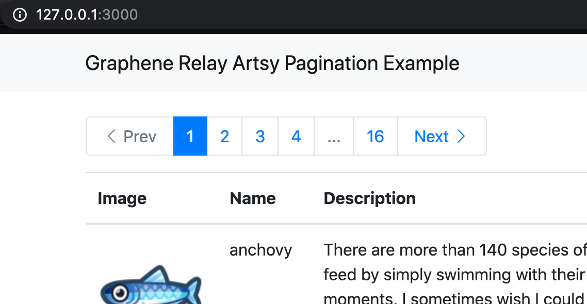
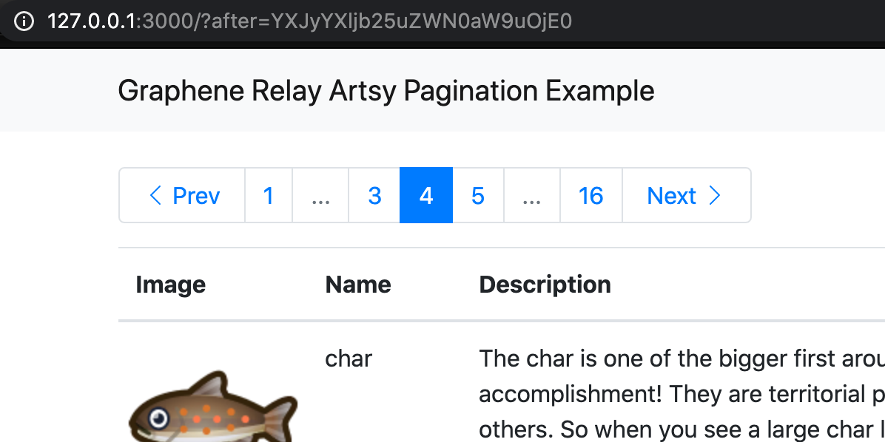
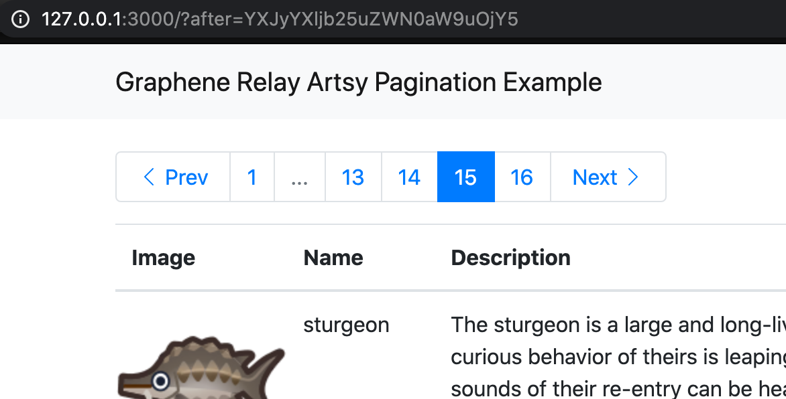
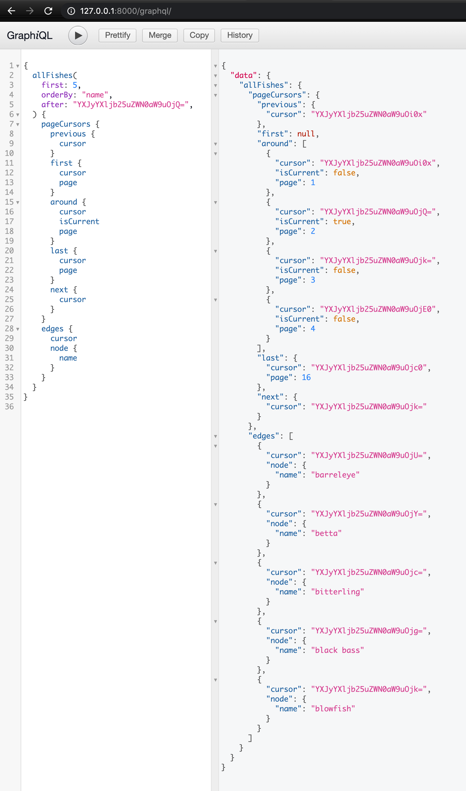

# Graphene Relay Artsy Pagination Example

This is an example GraphQL API using [Relay connections](https://relay.dev/graphql/connections.htm) to power a discretely paged Amazon-like pagination UI. Connections are designed for infinite-scroll UIs, however Artsy Engineering developed a solution to use them with discretely paged UIs as described in their article: [Effortless Pagination with GraphQL and Relay? Really!](https://artsy.github.io/blog/2020/01/21/graphql-relay-windowed-pagination/)

This repo contains an implementation of the Artsy pagination API in [Graphene](https://graphene-python.org/), [Django](https://www.djangoproject.com/), and Python and a corresponding web app using [Relay](https://relay.dev/), React, and TypeScript.

#### Vanilla Graphene Relay pagination example

For a vanilla Graphene Relay pagination API, which works well with an infinite scroll UI, see [my basic pagination example](https://github.com/saltycrane/graphene-relay-pagination-example/tree/basic-example).

#### Screenshots

**Beginning**


**Middle**


**End**


## Graphene GraphQL API server

The Artsy pagination API augments the Relay Connection type with an additional `pageCursors` field that contains metadata used to implement the pagination UI. I ported their [TypeScript code in `artsy/metaphysics`](https://github.com/artsy/metaphysics/blob/11bcc29569e3a9bd9a8f9b2f0a31af1e65e88986/src/schema/v2/fields/pagination.ts) and [`relay-cursor-paging`](https://github.com/darthtrevino/relay-cursor-paging/blob/177eca6975ef7cd602caf2f92edbeed00cabf3b9/src/getPagingParameters.ts) to Python using Graphene and Django.

Data is stored in a PostgreSQL database running in Docker. It is seeded with fish fixture data from [ACNHAPI](https://github.com/alexislours/ACNHAPI). Django is configured to log SQL queries to the console and show that SQL queries use `COUNT`, `LIMIT`, and `OFFSET`. Example:

``` sql
SELECT COUNT(*) AS "__count" FROM "fishes_fish";
SELECT "fishes_fish"."id", "fishes_fish"."description", "fishes_fish"."icon_url", "fishes_fish"."name", "fishes_fish"."price" FROM "fishes_fish" ORDER BY "fishes_fish"."name" ASC LIMIT 5 OFFSET 5;
```

### Usage

- Install Python 3.8
- Install packages, set up database, and run dev server
    ``` sh
    $ cd graphene-api
    $ python3 -m venv venv
    $ source venv/bin/activate
    $ pip install -r requirements.txt
    $ docker-compose up -d
    $ ./bin/resetdb
    $ ./manage.py migrate
    $ ./manage.py loaddata fishes
    $ ./manage.py runserver
    ```

- Go to http://127.0.0.1:8000/graphql/ in the browser

- Run the following query:
    ``` graphql
    {
      allFishes(first: 5, orderBy: "name") {
        pageCursors {
          previous {
            cursor
          }
          first {
            cursor
            page
          }
          around {
            cursor
            isCurrent
            page
          }
          last {
            cursor
            page
          }
          next {
            cursor
          }
        }
        edges {
          cursor
          node {
            name
          }
        }
      }
    }
    ```
    
    **GraphiQL query screenshot**
    

#### Generate GraphQL schema

``` sh
$ ./manage.py graphql_schema --schema pagination_ex_api.schema.schema --out ../schema.graphql
```

### Interesting backend code in this repo

- [/graphene-api/fishes/schema.py](/graphene-api/fishes/schema.py)
- [/graphene-api/artsy_relay_pagination/fields.py](/graphene-api/artsy_relay_pagination/fields.py)
- [/graphene-api/artsy_relay_pagination/pagination.py](/graphene-api/artsy_relay_pagination/pagination.py)

### Relevant code in other repos

#### TypeScript

- https://github.com/artsy/metaphysics/blob/production--2021-01-22--15-05-38/src/schema/v2/fields/pagination.ts
- https://github.com/artsy/metaphysics/blob/production--2021-01-22--15-05-38/src/lib/helpers.ts#L90-L104
- https://github.com/darthtrevino/relay-cursor-paging/blob/v0.2.0/src/getPagingParameters.ts
- https://github.com/graphql/graphql-relay-js/blob/v0.5.4/src/connection/arrayconnection.js

#### Python
- https://github.com/graphql-python/graphene-django/blob/v2.15.0/graphene_django/filter/fields.py
- https://github.com/graphql-python/graphene-django/blob/v2.15.0/graphene_django/fields.py#L132-L177
- https://github.com/graphql-python/graphql-relay-py/blob/v2.0.1/graphql_relay/connection/arrayconnection.py#L30-L104

## React Relay Next.js web app

In addition to Relay, React, and TypeScript, the frontend UI uses [relay-hooks](https://github.com/relay-tools/relay-hooks), [Next.js](https://nextjs.org/), and [reactstrap](https://reactstrap.github.io/). It takes advantage of [Relay fragments](https://relay.dev/docs/en/thinking-in-relay) and [Next.js routing](https://nextjs.org/docs/routing/introduction#linking-between-pages) to store pagination state.

### Usage

- Install Node.js 14
- Install packages and run dev server
  ``` sh
  $ cd react-relay-webapp
  $ npm install
  $ npm run devserver
  ```

- Go to http://127.0.0.1:3000 in the browser

### Notes

Server-side rendering (SSR) [is disabled](/react-relay-webapp/src/pages/index.tsx) because it's difficult to set up and isn't important for this example.

### Interesting frontend code in this repo

- [/react-relay-webapp/src/FishesPage.tsx](/react-relay-webapp/src/FishesPage.tsx)
- [/react-relay-webapp/src/FishesPagination.tsx](/react-relay-webapp/src/FishesPagination.tsx)
